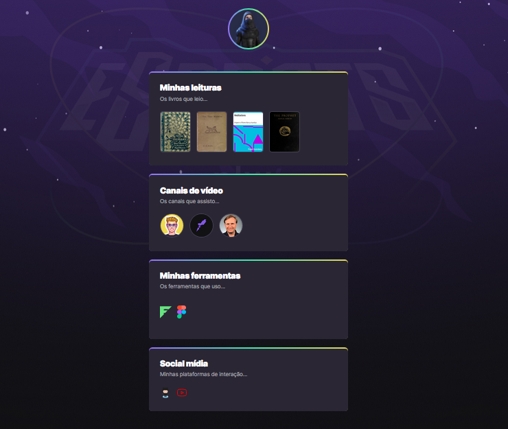

# NLW eSports

>Trilha Explorer

Projeto construído no evento 'Next Level Week' da Rocketseat.

🔗 [Clique aqui para acessar](https://amazondale.github.io/nlw-profile-explorer/)

## ⚒️ Tecnologias

- HTML
- CSS
- Git & Github

## O que aprendi

Estruturação de página html com estrutura adequada para estilização no CSS.

No CSS propriedades como transform:scale, keyframes, transition, animation, fonts, letter-spacing, display, flex-wrap, etc.

Sincronização e boas práticas de repositório Git.

## 🌐 Contato

📩 amazon.dale2020@gmail.com

☎️ +55 (69) 99339-3778

  